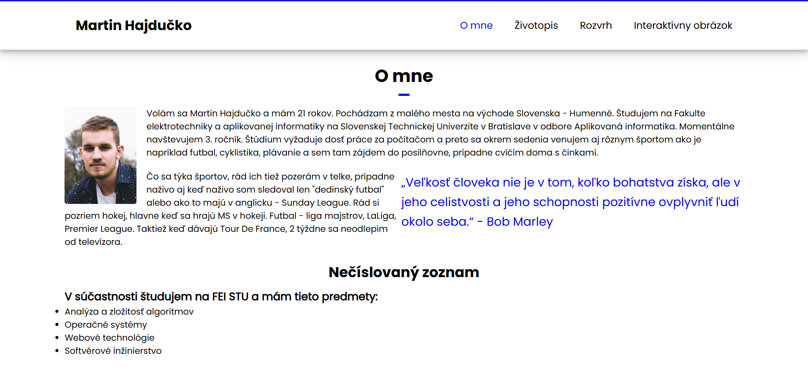
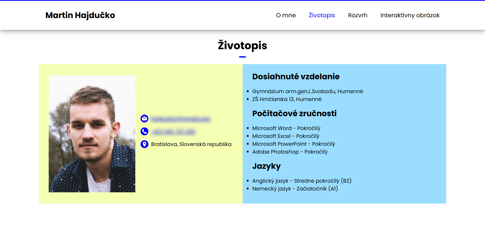
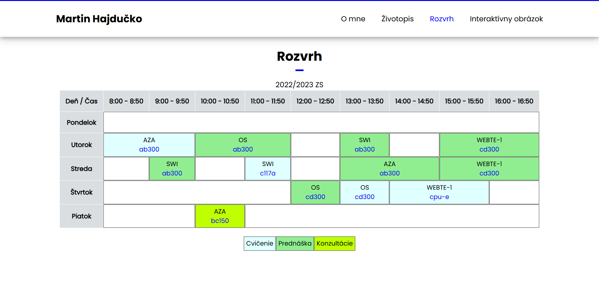
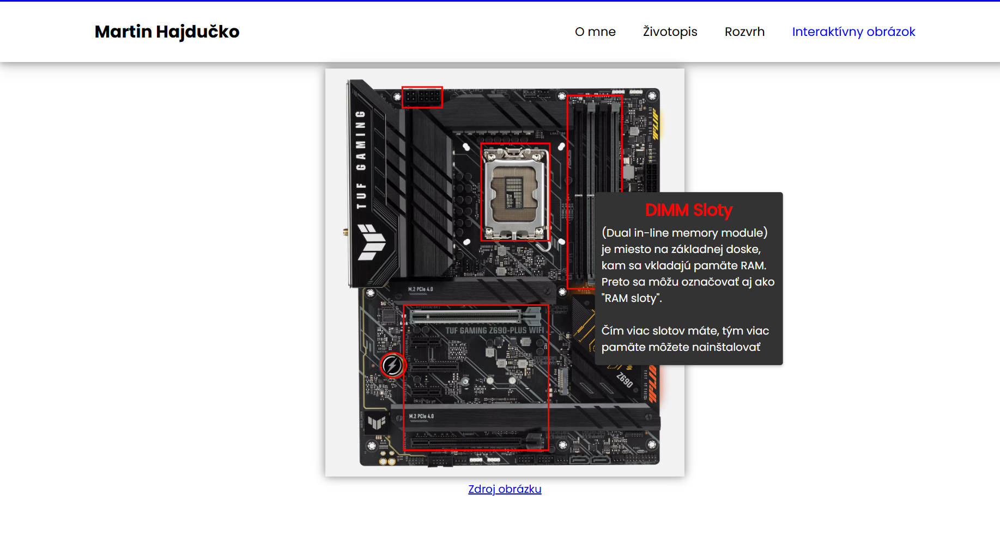

# FEI STU | WEBTE-1 | Zadanie 1  

## 📌 Jednoduchý web  

Cieľom tohto zadania bolo zoznámiť sa s html/css a vytvoriť webstránku s prvkami ktoré sme sa učili

## 📖 Popis projektu  

- Na úvodnej stránke je krátky text o mne ktorý mal obsahovať obrázok ktorý "pláva v texte", citát a nečíslovaný zoznam.
- Podstránka životopis mala obsahovať 2 sekcie, na jednej kontaktné údaje a na druhej dosiahnuté vzdelanie a iné informácie, obe sekcie majú farebné pozadie a pri mobilnej verzii sa zobrazia pod sebou (používanie flex v css).
- Podstránka rozvrh - tvorba tabuľky v html
- Interaktívny obrázok - na obrázku mali byť vyznačené časti a pri prechode myšou sa mal zobraziť "tooltip"

## 🖼️ Ukážky  

### 🏠 Úvodná stránka  
  

### 🧑‍🎓 Životopis  
  

### 📅 Rozvrh  
  

### 🖼️ Interaktívny obrázok  
  

---

ℹ️ *Tento projekt bol vytvorený ako súčasť predmetu WEBTE-1 na FEI STU (2022).* 